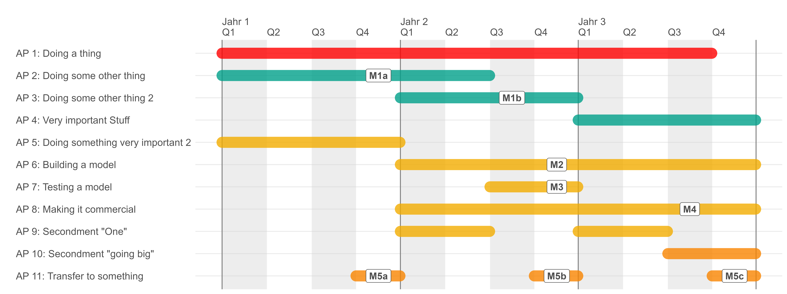

# gantt_chart_quarters
R code with an example to create Gantt Charts with Quarters.

## Source

Based on [ganttrify](https://github.com/giocomai/ganttrify/) by [giocomai](https://github.com/giocomai) and a modification by [dmkaplan2000](https://github.com/dmkaplan2000) (see [Issue](https://github.com/giocomai/ganttrify/issues/40)).

# How to use

This is **not a package**. The provided code and example sheet should be self-explanatory.

# Files
```R
gantt_chart.R      # Code example that sources gannt_graph_code.R
gantt_graph_code.R # Code for the creation of the Gantt chart
gantt_source.xlsx  # Gantt WP/Activity & Milestone definitions (example)
```

# Example output

